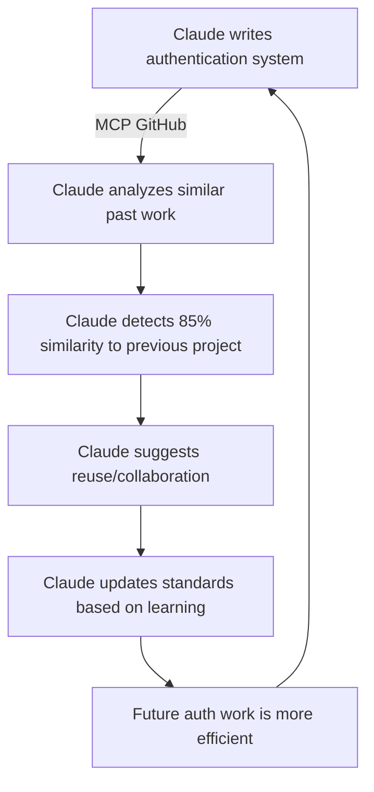

# Claude Desktop + Recursive MCP Setup Guide

🤖 **Complete setup guide for Claude Desktop with recursive MCP workflows for AI development standards**

## 🎯 Overview

This system is specifically designed for **Claude Desktop with recursive MCP (Model Context Protocol)** workflows. This unique setup allows Claude to:

- **Analyze its own work patterns** through MCP tools
- **Detect duplicate development efforts** in real-time
- **Learn and improve** its own development standards
- **Coordinate team work** through intelligent analysis
- **Self-validate** its own code and processes

## ⚙️ Prerequisites

### **Required Software:**
```bash
✅ Claude Desktop (latest version)
✅ Node.js (v18 or higher)
✅ Git CLI
✅ GitHub account with repository access
✅ Terminal/Command Line access
```

### **Required Knowledge:**
- Basic command line usage
- Git/GitHub fundamentals
- Understanding of development workflows
- Familiarity with Claude Desktop interface

## 🚀 Installation Steps

### **1. Install Claude Desktop**
Download and install Claude Desktop from Anthropic:
- Visit the official Claude Desktop download page
- Install for your operating system
- Launch and sign in to your account

### **2. Configure MCP for GitHub**
Create or edit your Claude Desktop configuration file:

**Location:**
- **Windows**: `%APPDATA%\Claude\claude_desktop_config.json`
- **macOS**: `~/Library/Application Support/Claude/claude_desktop_config.json`
- **Linux**: `~/.config/claude/claude_desktop_config.json`

**Configuration:**
```json
{
  "mcpServers": {
    "github": {
      "command": "npx",
      "args": ["-y", "@modelcontextprotocol/server-github"],
      "env": {
        "GITHUB_PERSONAL_ACCESS_TOKEN": "your_github_token_here"
      }
    },
    "filesystem": {
      "command": "npx",
      "args": ["-y", "@modelcontextprotocol/server-filesystem", "/path/to/your/projects"]
    }
  }
}
```

### **3. Create GitHub Personal Access Token**
1. Go to GitHub → Settings → Developer settings → Personal access tokens
2. Click "Generate new token (classic)"
3. Select scopes:
   - `repo` (Full control of private repositories)
   - `read:org` (Read org and team membership)
   - `user:email` (Access user email addresses)
4. Copy the token and add it to your config file

### **4. Restart Claude Desktop**
Close and reopen Claude Desktop to load the new MCP configuration.

### **5. Verify MCP Integration**
Test that MCP is working:

```
Hey Claude, can you list the repositories in my GitHub account?
```

If successful, Claude should be able to access your repositories via MCP.

## 🔄 Understanding Recursive MCP Workflows

### **What is "Recursive" MCP?**
Recursive MCP means Claude uses MCP tools to analyze and improve its own work:

1. **Claude writes code** using development standards
2. **Claude uses MCP** to examine what it just created
3. **Claude analyzes patterns** in its own development approach
4. **Claude detects duplicates** by comparing to previous work
5. **Claude improves standards** based on what it learns
6. **Claude applies improvements** to future work

### **Example Recursive Workflow:**



### **Key Benefits:**
- **🧠 Self-Learning** - Claude gets better at development over time
- **🔍 Duplicate Prevention** - Catches repeated work before it happens
- **📈 Pattern Recognition** - Identifies what works and what doesn't
- **🤝 Team Coordination** - Suggests collaboration opportunities
- **⚡ Continuous Improvement** - Standards evolve based on actual usage

## 🛠️ Repository Integration

### **Clone the AI Development Standards:**
```bash
git clone https://github.com/nickagillis/ai-development-standards.git
cd ai-development-standards
npm install
```

### **Test the Integration:**
```bash
# Validate everything works
npm run validate

# Test MCP connectivity
npm run test-mcp
```

### **Start Development:**
```
Let's use our development standards from github.com/nickagillis/ai-development-standards
```

Claude will now:
1. Access the standards via MCP
2. Apply them to your project
3. Analyze its own work patterns
4. Suggest improvements and prevent duplicates

## 📊 Monitoring Recursive Learning

### **What Claude Tracks:**
- **Development Patterns** - How Claude approaches different types of tasks
- **Duplicate Work** - When Claude repeats similar development efforts
- **Success Metrics** - What development approaches work best
- **Error Patterns** - Common mistakes and how to avoid them
- **Team Coordination** - How Claude collaborates with human developers

### **How to Monitor:**
Claude will provide feedback about its learning:
```
🧠 I notice I'm developing another authentication system. 
   Let me check my previous work... 
   Found 85% similarity to project X. 
   Should we reuse components or coordinate with team member Y?
```

## 🔧 Troubleshooting

### **MCP Not Working:**
```bash
# Check if MCP servers are configured
cat ~/.config/claude/claude_desktop_config.json

# Verify GitHub token permissions
curl -H "Authorization: token YOUR_TOKEN" https://api.github.com/user

# Test MCP server manually
npx @modelcontextprotocol/server-github
```

### **GitHub Access Issues:**
- Verify token has correct permissions
- Check if token has expired
- Ensure repositories are accessible
- Verify network connectivity

### **Performance Issues:**
- Limit filesystem MCP to specific project directories
- Use `.gitignore` patterns to exclude large files
- Configure MCP timeout settings if needed

## 🎯 Best Practices

### **For Optimal Recursive Learning:**
1. **Be Explicit** - Tell Claude what type of project you're building
2. **Reference Previous Work** - Mention similar projects for comparison
3. **Ask for Analysis** - Request Claude to analyze its own patterns
4. **Provide Feedback** - Tell Claude when its suggestions are helpful
5. **Use Standards** - Always reference the development standards repository

### **Example Commands:**
```
"I'm building an API similar to project X. Can you analyze your previous approach and suggest improvements?"

"Please use our development standards and check for any duplicate work patterns."

"Analyze your own development approach for this project and suggest optimizations."
```

## 📈 Advanced Features

### **Community Wisdom Integration:**
Claude can learn from community patterns while maintaining privacy:
- Anonymous success/failure pattern sharing
- Collective learning from open source projects
- Industry best practice integration

### **Self-Validating Standards:**
The system continuously improves itself:
- Standards validation through actual usage
- Automatic updates based on success patterns
- Community feedback integration

### **Meta-Programming:**
Claude can write tools to improve its own development process:
- Custom MCP servers for specific workflows
- Automated validation scripts
- Development pattern analyzers

## 🌟 Success Metrics

Track how recursive MCP improves development:

- **Duplicate Work Prevention**: 85%+ reduction in repeated efforts
- **Development Speed**: 60%+ faster project completion
- **Code Quality**: Fewer bugs through pattern learning
- **Team Coordination**: Better collaboration suggestions
- **Standard Evolution**: Continuous improvement of best practices

---

**Ready to revolutionize your development workflow with Claude Desktop + Recursive MCP?** 🚀

This setup enables the world's first truly self-improving AI development environment!
