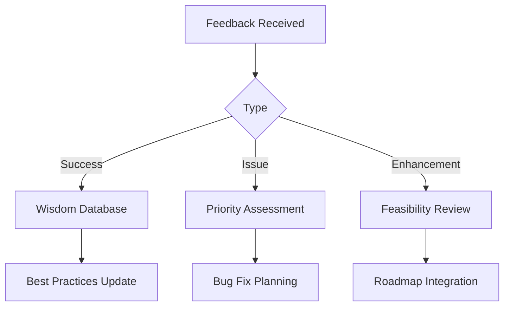

# Community Feedback System Overview

## 🎯 Purpose

The Community Feedback System operationalizes the Community Wisdom Engine, creating structured channels for users to share experiences and improve the AI Development Standards.

## 📋 Feedback Channels

### **GitHub Issues Templates**
- **Success Stories**: Share successful implementations
- **Issue Reports**: Report problems or gaps
- **Enhancement Requests**: Suggest improvements

### **GitHub Discussions**
- **Ideas & Suggestions**: New features and improvements
- **Show and Tell**: Project showcases
- **Q&A**: Questions and troubleshooting
- **Polls**: Community voting on priorities

### **Automated Collection**
- Optional telemetry from validation scripts
- Usage analytics (anonymous)
- Performance metrics

## 🔄 Processing Workflow

## 📊 Community Metrics

- **Engagement**: Monthly active contributors, submissions
- **Quality**: Success scores, resolution times
- **Impact**: Adoption rates, productivity improvements

## 🏆 Recognition System

- 🌱 **Newcomer**: First submission
- 📈 **Contributor**: 5+ helpful submissions  
- 🏆 **Wisdom Keeper**: 15+ high-impact contributions
- 💎 **Community Champion**: Sustained contributions
- 🧠 **Standards Architect**: Major improvements

## 🚀 Implementation Status

- ✅ **Phase 1**: GitHub templates and discussions
- 🔄 **Phase 2**: Automated collection and analytics
- 📋 **Phase 3**: AI-powered insight extraction

See detailed documentation in:
- [Feedback Templates](./community-feedback-templates.md)
- [Analytics System](./community-analytics.md)
- [Recognition Program](./community-recognition.md)